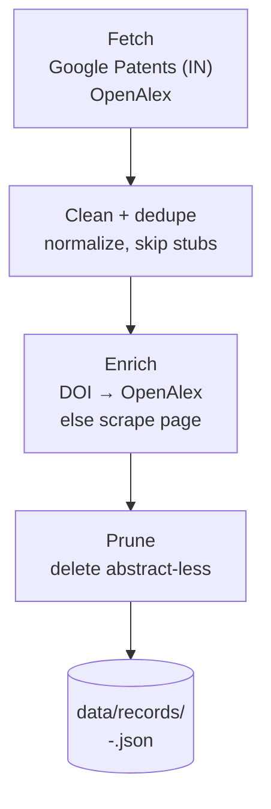
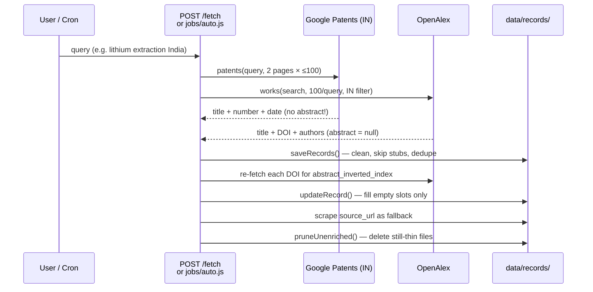
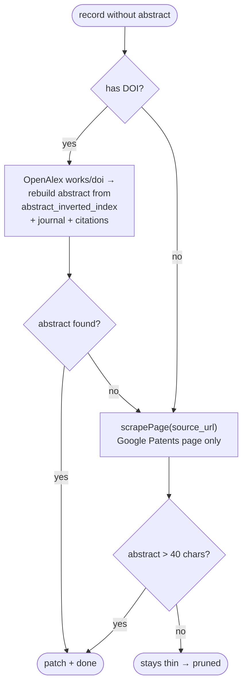
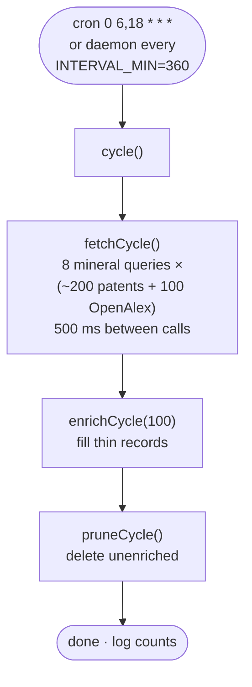

# mineral-intel-node

Collects India's critical-mineral intelligence from free patent & research APIs (Google Patents + OpenAlex, no keys), enriches every record with an abstract, and stores the clean corpus as one JSON file per record.

```bash
npm install
npm start              # API on http://localhost:8000
npm run auto           # single fetch + enrich + prune cycle (cron-friendly)
```

---

## Project structure

```text
src/
  index.js                 # entry: start the API server
  config.js                # all env config (port, queries, dirs, limits)
  utils/
    http.js                # getJson, [pending] stub, sleep
    dates.js               # YYYY-MM-DD helpers, newest-first, stamp
  services/
    patents.service.js     # Google Patents fetcher (patents)
    research.service.js    # OpenAlex fetcher (research)
    scrape.service.js      # patents.google.com page parser
    store.service.js       # file store: clean, dedupe, prune
    enrich.service.js      # fill missing abstracts
  server/
    app.js                 # Express wiring
    routes/                # fetch.routes, records.routes
    controllers/           # fetch.controller, records.controller
  jobs/
    auto.js                # daemon / cron loop
test/
  api.test.js              # offline tests (no network)
```

---

## How data flows





### 1. Fetch — `services/patents.service.js` + `research.service.js`

Any source failure degrades to a `[pending]` stub (`{ title: "[pending] <query>", collector_note }`) that the store skips — outages become `received:1, inserted:0`, never crashes or junk files.

| Fetcher | Key | Volume | Notes |
|---|---|---|---|
| `patents(query, pages=2, {since, until, latest})` | none | ~200/query | Google Patents XHR, `country=IN`. No abstract — enrichment scrapes it later. A failed page keeps earlier pages; stub only if nothing arrived. `latest` adds `sort=new` + sorts newest-first; `since/until` filter client-side. |
| `openalex(query, {perPage=100, indiaOnly, mailto, since, until, latest})` | none | 100/query | `filter=institutions.country_code:IN` when `indiaOnly`. Abstract is `null` here — rebuilt per-DOI during enrichment. `since/until` go server-side (`from/to_publication_date`) plus a client-side check. |

### 2. Clean + store — `services/store.service.js`

One file per record in `data/records/` (`RECORDS_DIR` overrides), named `<slug>-<id>.json` (slug ≤60 chars, id = 6 random bytes). Names self-heal on every save + server startup.

Dedupe key: `pub:<number>` → `doi:<doi>` → first 80 alnum chars of title. Titles <3 chars and `[pending]` stubs are skipped.

### 3. Enrich — `services/enrich.service.js` + `scrape.service.js`



`updateRecord()` only fills **empty** slots — good data is never overwritten. `enrichIds(ids, limit=50)` reloads each record fresh from disk with a 300 ms sleep between items. The scraper (`fetch` + regex, zero deps) returns only what enrichment consumes.

### 4. Prune — the garbage collector

`pruneUnenriched(40)` deletes files with missing/short abstracts or `[pending]` titles. After this step the directory holds **enriched records only**.

---

## Automation — `src/jobs/auto.js`



```bash
node src/jobs/auto.js                 # daemon: cycle now, repeat every INTERVAL_MIN
node src/jobs/auto.js --once          # single cycle, then exit (cron-friendly)
QUERIES="lithium battery India,graphite anode" npm run auto   # scoped run
SINCE_DAYS=90 LATEST=true npm run auto                        # last 90 days, newest first
```

Default queries cover lithium, cobalt, nickel, rare earths, graphite, manganese, titanium, copper (overridable via `QUERIES`).

---

## API reference

**`POST /fetch`** (alias `POST /ingest`):

```jsonc
{ "patents": "lithium extraction India", "patent_pages": 2,
  "research": "cobalt battery", "india_only": true,
  "query": "graphite anode",                 // legacy: patents + research together
  "since": "2024-01-01", "latest": true,
  "records": [{ "title": "My patent", "publication_number": "IN202400001" }] }
```

Empty → `400`. Success → `200 { ok, received, inserted, duplicates, renamed, enriched }`.

| Endpoint | Result |
|---|---|
| `GET /records?limit=100&since=2024-01-01&sort=newest` | `{ total, records }`, limit clamped 1–1000 |
| `GET /records/:id` | record or `404` |
| `GET /health` | `{ ok:true }` |
| `GET /` | HTML cheat-sheet |

---

## Config, tests

Env (plain exports, all read in `src/config.js`): `PORT` (8000) · `RECORDS_DIR` · `QUERIES` · `INTERVAL_MIN` (360) · `SINCE` / `SINCE_DAYS` / `UNTIL` / `LATEST` · `OPENALEX_MAILTO`.

`npm test` — 3 offline tests (temp `RECORDS_DIR`, ephemeral ports): record round trip with dedupe, empty/unknown-source `400`, and `since` + `sort=newest` filtering.

Resilience by design: per-source `[pending]` stubs (never stored) · per-query try/catch in the job (one bad query can't kill a cycle) · enrich swallows page-level errors. Politeness: 500 ms between queries, 300 ms between enrich items.
